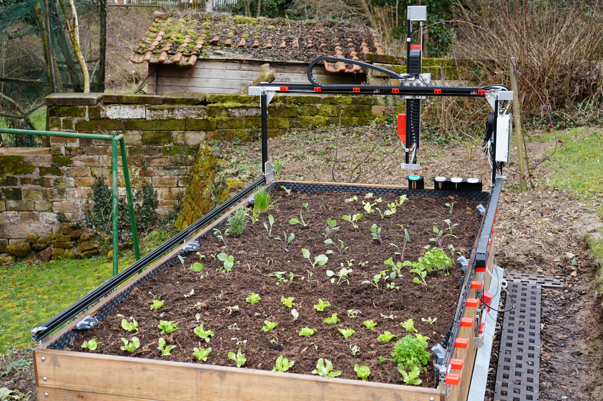

# FarmBot-Sequences
Collection of Sequences for a FarmBot Genesis 1.5

This FarmBot differs from the kit version in it's camera. This one uses a HD-camera which is bigger than the original one. It takes sharp photos at nighttime, the automatic mode overexposes images in daylight.

## How to use

The FarmBot uses a grephical programming laguage for it's "Sequences". A "Sequence" is a program in this language. As these are graphical in nature they can not be saved easily as text files. Because of that you find a collection of screenshots in this repository. Sadly you will not be able to copy them into your account.

## Structure

The folders in the repository correspond to folders in the sequence editor. The screenshot names match the names of the sequences.
